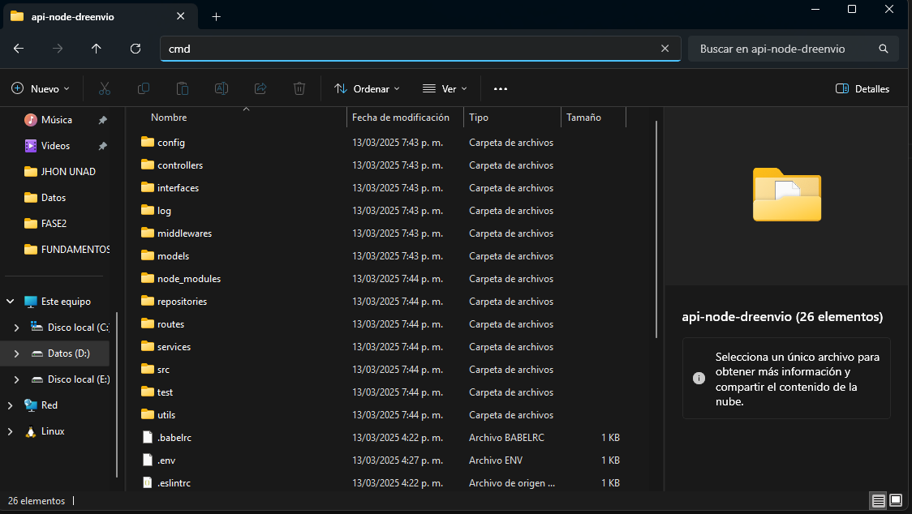
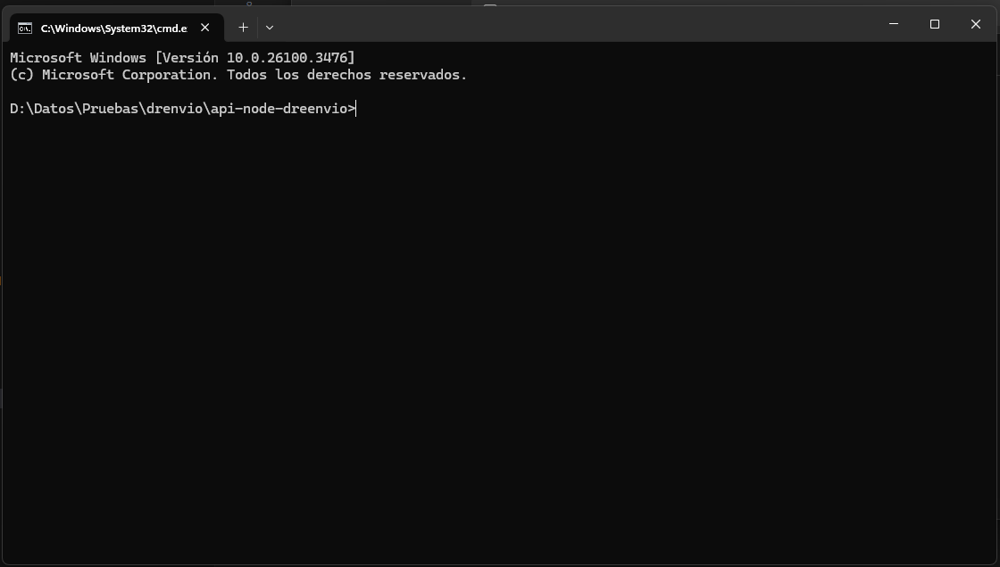

# Información del Proyecto

Este proyecto es una API RESTful desarrollada con Node.js y Express que permite la creación y actualización de precios especiales. También consume APIs para listar productos y usuarios.

## Introducción

La API está diseñada para facilitar la gestión de precios especiales en una plataforma. Proporciona endpoints para crear, actualizar y consultar precios, así como para integrar datos de productos y usuarios desde otras APIs.

## Tecnologías Utilizadas

- Node.js
- MongoDB
- Patrón Repository
- Docker
- Swagger UI
- Buenas Prácticas
- Validaciones
- Middlewares
- Control de Log
- Jest - Automatización de pruebas 
## Pasos para Ejecutar el Proyecto

### Opción 1: Ejecutar Localmente

1. Clonar o descargar el proyecto.
2. Asegurarse de tener instalados Node.js, npm y MongoDB (si deseas monitorear tu base de datos).
3. Abrir la consola (cmd) en la ubicación del proyecto. Una manera es navegar a la carpeta del proyecto, escribir `cmd` en la barra de direcciones y presionar Enter.
   
   
4. Ejecutar `npm install` para instalar las dependencias.
5. Para correr el proyecto, ejecutar `npm start`.
6. Para correr las pruebas, ejecutar `npm test`.

### Opción 2: Ejecutar con Docker

1. Asegurarse de tener Docker instalado y en ejecución.
2. Ejecutar `docker-compose up --build` o `docker-compose up -d --build`.
3. Acceder a la URL [http://localhost:3000/](http://localhost:3000/).
4. Para detener y eliminar los contenedores, ejecutar `docker-compose down`.

### Pruebas automatizadas.

Ubicarte en la ruta del proyecto, consola y ejecutar `node "node_modules/jest/bin/jest.js" "d:/Datos/Pruebas/drenvio/api-node-dreenvio/test/specialPrices/specialPrices.test.js" -t "API de precios especiales"`

## Justificación de Elecciones Técnicas

- **Node.js**: Elegido por su eficiencia y capacidad para manejar aplicaciones de red escalables.
- **MongoDB**: Base de datos NoSQL que permite un desarrollo ágil y flexible, ideal para manejar datos no estructurados.
- **Patrón Repository**: Facilita la separación de lógica de acceso a datos y lógica de negocio, mejorando la mantenibilidad del código.
- **Docker**: Permite la creación de entornos de desarrollo consistentes y portables, facilitando la implementación y escalabilidad.
- **Swagger UI**: Herramienta para documentar y probar la API de manera interactiva, mejorando la experiencia del desarrollador.
- **Buenas Prácticas**: Aseguran la calidad y mantenibilidad del código.
- **Validaciones**: Garantizan la integridad y consistencia de los datos.
- **Middlewares**: Facilitan la gestión de peticiones y respuestas, mejorando la modularidad del código.
- **Control de Log**: Permite el monitoreo y depuración de la aplicación.

## Descripción de la Estructura del Proyecto

```
/api-node-dreenvio
├── src
│   ├── controllers
│   ├── models
│   ├── repositories
│   ├── routes
│   ├── services
│   ├── middlewares
│   ├── utils
│   └── app.js
├── test
│   ├── controllers
│   ├── models
│   ├── repositories
│   ├── routes
│   ├── services
│   └── middlewares
├── Dockerfile
├── docker-compose.yml
├── package.json
└── README.md
```

- **controllers**: Contiene la lógica de controladores que manejan las peticiones HTTP.
- **models**: Define los esquemas de datos y modelos de MongoDB.
- **repositories**: Implementa el patrón Repository para la abstracción de acceso a datos.
- **routes**: Define las rutas de la API.
- **services**: Contiene la lógica de negocio de la aplicación.
- **middlewares**: Incluye middlewares personalizados para la gestión de peticiones y respuestas.
- **utils**: Funciones utilitarias y helpers.
- **app.js**: Punto de entrada de la aplicación.
- **test**: Contiene las pruebas unitarias y de integración.
